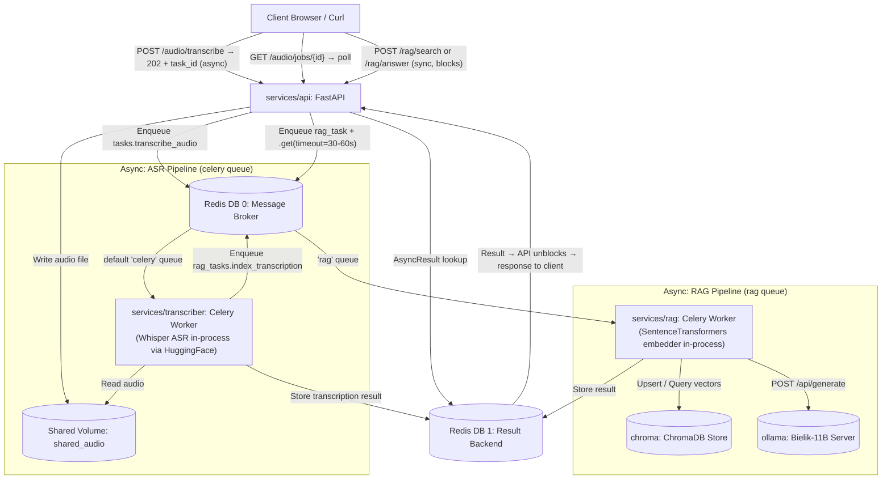

# Audio RAG API

Audio RAG API is a lightweight, fully decoupled, microservices-driven REST API engineered with FastAPI, Celery, Redis, ChromaDB, and an offline instances of Ollama. It enables end-to-end execution of oral client banking speech requests: Audio Upload → Whisper ASR Transcription → Sentence Embeddings Indexing → Semantical Vector Database Retrieval → Grounded Polish RAG Response Synthesis.

---

## 1. Directory Structure

The repository is modularized to maintain separation of concerns, separate build packages, and clear execution runtimes:

- `deploy/` — Contains orchestration files, including `docker-compose.yml` and the placeholder `k8s/` manifests folder for infrastructure management.
- `schemas/` — Houses unified Pydantic v2 data models (`models.py`) used by both the API gateway and background task consumers for consistent serialization.
- `services/` — Contains implementation directories for each distinct microservice:
  - `api/` — FastAPI application dealing with validation, file buffering, and Celery task dispatching.
  - `transcriber/` — Whisper speech-to-text Celery worker equipped with ffmpeg and ASR processing libraries.
  - `rag/` — RAG indexing, vector store interface, and local LLM generation handler.
  - `ollama/` — Customized Ollama Dockerfile designed to pre-compile neural model layers.
- `static/sample_files/` — Sample `.wav` audio files used for local development and end-to-end testing.

---

## 2. Decoupled Microservices Architecture

The system splits workloads into lightweight runtime layers. This avoids overloading images with conflicting dependencies and allows independent horizontal scaling. `/audio/transcribe` is **fully asynchronous** — the API returns a task ID immediately and the client polls for completion. `/rag/search` and `/rag/answer` are **synchronous from the client's perspective** — the API internally dispatches a Celery task and blocks on the result before responding.



---

## 3. Core Processing Pipelines

### 3.1 Audio Upload and ASR Pipeline
1. **Request Reception:** Client uploads audio to `POST /audio/transcribe` as `multipart/form-data`.
2. **Strict Validation:** The API validates the file's MIME type against `ALLOWED_CONTENT_TYPES` (supporting `audio/wav`, `audio/mpeg`, `audio/ogg`, `audio/flac`, `audio/x-wav`). Invalid formats instantly trigger a `400 Bad Request`.
3. **Shared Buffer:** The stream is buffered to the `/shared` directory on a shared volume so background workers can access the physical file.
4. **ASR Dispatch:** The API enqueues `tasks.transcribe_audio` onto Redis and returns a `202 Accepted` status with the job ID.
5. **Inference Execution:** The transcriber worker runs the audio through the loaded Whisper Model (`openai/whisper-tiny`). The model is loaded once at worker startup during `worker_process_init` to optimize RAM usage.
6. **Task Chaining:** Once completed, the transcriber triggers `rag_tasks.index_transcription` to index the output on the `rag` queue.

### 3.2 Celery Pending Ambiguity Resolution
In Celery, a task ID that is not yet processed exists as `PENDING` by default. However, non-existent target task IDs also return `PENDING`. To avoid returning a false positive when query polling, the API handles the state as follows:
- When a client hits `/audio/jobs/{job_id}`, if the status is active (`SUCCESS`, `FAILURE`, `STARTED`, etc.), it maps directly.
- If the status is `PENDING`, the API broadcasts an inspection call `celery.control.inspect(timeout=1.0).query_task(job_id)` to all workers, waiting up to 1 second for responses.
- If no worker reports tracking the task (active or queued), a clean `404 Not Found` exception is returned of a false state.

### 3.3 Semantic Vector Indexing
- The RAG worker receives text transcriptions alongside their corresponding source audio paths.
- It parses the transcription text through `SentenceTransformer("paraphrase-multilingual-MiniLM-L12-v2")` to generate a 384-dimensional semantic embedding.
- The dense vector is persisted in a ChromaDB database collection configured with the cosine distance space metric.
- It uses the transcription's task ID as the primary key for the document, ensuring complete traceability back to the raw source audio.

### 3.4 Grounded QA Answer Synthesis
- The user requests an answer to a question through `POST /rag/answer`.
- The RAG celery worker generates an embedding for the user's question, performs a query on ChromaDB, and retrieves the `top_k` matching transcriptions.
- The matcher records are gathered and injected into a strict Polish system instruction context: *Na podstawie poniższych transkrypcji odpowiedz na pytanie. Odpowiadaj tylko na podstawie podanych transkrypcji.*
- A POST request is sent to the local Ollama backend hosting SpeakLeash's Polish instruction-tuned LLM `SpeakLeash/bielik-11b-v2.3-instruct:Q4_K_M`.
- The synthesized response is returned to the client along with the matching transcription texts and analytical metadata distance scores.

---

## 4. Containerization and Operational Guide

### 4.1 Build Context Scoping
Build contexts are scoped per service so that unrelated service code, host virtual environments (`.venv`), Python compilation files (`__pycache__`), and temporary files from other services are not included in each image. The `api` and `rag` services use the repository root as context (to reach the shared `schemas/` package), while `transcriber` and `ollama` use their own service directory as context.

### 4.2 Pre-baked Neural Model Layering
To bypass intermediate download timeouts or cold-start boot delays during runtime execution, SpeakLeash Bielik-11B model weights are fetched and saved during the Docker image building phase. The `services/ollama/Dockerfile` serves the engine in background, waits for connectivity, and stores the pulled model weights inside `/root/.ollama` at build time.

### 4.3 Running the Application
From the repository root directory, execute the following commands:

```bash
# Build the images (including pre-baking the Bielik model weights)
docker compose -f deploy/docker-compose.yml build

# Start the cluster in decoupled background mode
docker compose -f deploy/docker-compose.yml up -d

# Inspect health check states across all nodes
docker compose -f deploy/docker-compose.yml ps

# Follow logs for the API or workers to debug
docker compose -f deploy/docker-compose.yml logs -f api rag
```

### 4.4 Bulk-uploading Sample Audio Files
To seed the vector store, upload all sample files from `static/sample_files/` in one pass:
```bash
mapfile -t files < <(find static/sample_files -name "sample*.wav") && for file in "${files[@]}"; do
  echo "Uploading: $file"
  curl -s -X POST http://localhost:8000/audio/transcribe \
    -F "file=@${file};type=audio/wav"
  echo
done
```
Each upload returns a `task_id`. Transcription and indexing happen in the background; use `GET /audio/jobs/{task_id}` to check individual job status.

---

## 5. API Reference and Examples

### GET `/health`
Returns the operational status of the service interface.
```bash
curl -s http://localhost:8000/health
```
**Response (200 OK):**
```json
{
  "status": "ok",
  "app": "Audio RAG API",
  "version": "0.1.0"
}
```

### POST `/audio/transcribe`
Upload a speech file (wav, mp3, ogg, flac) for background transcription.
```bash
curl -s -X POST http://localhost:8000/audio/transcribe \
  -F "file=@static/sample_files/sample.wav;type=audio/wav"
```
**Response (202 Accepted):**
```json
{
  "task_id": "7dcde789-f538-4229-87bd-8fe2fdc0989c",
  "status": "processing"
}
```

### GET `/audio/jobs/{job_id}`
Poll the status of speech-to-text processing.
```bash
curl -s http://localhost:8000/audio/jobs/7dcde789-f538-4229-87bd-8fe2fdc0989c
```
**Response (200 OK - Processing completed):**
```json
{
  "job_id": "7dcde789-f538-4229-87bd-8fe2fdc0989c",
  "status": "completed",
  "transcription": "dzień dobry chciałem zgłosić zagubienie mojej karty płatniczej",
  "error": null
}
```

### POST `/rag/search`
Perform semantic similarity search over registered audio transcripts.
```bash
curl -s -X POST http://localhost:8000/rag/search \
  -H "Content-Type: application/json" \
  -d '{"query": "zgubiona karta płatnicza", "top_k": 3}'
```
**Response (200 OK):**
```json
{
  "query": "zgubiona karta płatnicza",
  "results": [
    {
      "id": "7dcde789-f538-4229-87bd-8fe2fdc0989c",
      "document": "dzień dobry chciałem zgłosić zagubienie mojej karty płatniczej",
      "metadata": {
        "source_path": "/shared/sample.wav"
      },
      "distance": 0.1873
    }
  ]
}
```

### POST `/rag/answer`
Generate a fully synthesized response grounded on matched banking transcriptions.
```bash
curl -s -X POST http://localhost:8000/rag/answer \
  -H "Content-Type: application/json" \
  -d '{"question": "co stało się z kartą płatniczą?", "top_k": 3}'
```
**Response (200 OK):**
```json
{
  "question": "co stało się z kartą płatniczą?",
  "answer": "Na podstawie podanych transkrypcji klient zgłosił zagubienie swojej karty płatniczej.",
  "sources": [
    {
      "id": "7dcde789-f538-4229-87bd-8fe2fdc0989c",
      "document": "dzień dobry chciałem zgłosić zagubienie mojej karty płatniczej",
      "metadata": {
        "source_path": "/shared/sample.wav"
      },
      "distance": 0.2145
    }
  ]
}
```